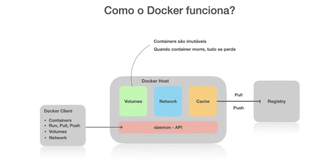
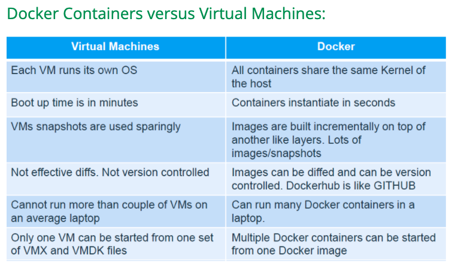

# System Administration
The field in IT that's responsible for maintaining reliable
computer systems in a multi-user environment

# Docker 
<a href="Inception/img/docker_1.png"> subject </a>

 
  

<a href="https://docs.docker.com/develop/develop-images/dockerfile_best-practices/">Dockerfile Best Practices</a>

Docker builds images automatically by reading the instructions from a 
Dockerfile -- a text file that contains all commands, in order, 
needed to build a given image. A Dockerfile adheres to a specific 
format and set of instructions which you can find at

<a href="https://docs.docker.com/engine/reference/builder/">Builder</a>

A Docker image consists of read-only layers each of which represents 
a Dockerfile instruction. The layers are stacked and each one is
a delta of the changes from the previous layer. Consider this Dockerfile:

// # syntx=docker/dockerfile:1 
FROM ubuntu:18.04 -> Creates a layer from the ubuntu:18.04 Docker Image 
WORKDIR /code ->  
ENV PORT 80  ->  named PORT  
COPY . /app -> adds files from your Docker client's current directory 
RUN  make /app -> builds your application with make 
CMD python /app/app.py -> specifies what command to run within the container

<h3>What is a container?</h3>
Um container e um padrao de unidade de software que empacota codigo e todas
as dependencias de uma aplicacao fazendo que a mesma seja executada rapidamente 
de forma confiavel de um abiente computacifonal para o outro.
<ul>
    <li>
        Is a runnable instance of an image. You can create, start, stop, move, 
        or delete a container using the DockerAPI or CLI.
    </li>
    <li>
        Can be run on local machines, virtual machines or deployed to the cloud.
    </li>
    <li>
       is portable (can be run on any OS)
    </li>
    <li>
       Containers are isolated from each other and run their own software, 
       binaries, and configurations.
    </li>
</ul>

Namespaces
Cgroups
File systems

docker run -p 8080:80 --name hello -d <name of image>  ->docker expose the port 
if the docker are running, try to see the project on browser :
localhost/8080
docker stop

docker run -d -p 80:80 docker/getting-started
You’ll notice a few flags being used. Here’s some more info on them:

-d - run the container in detached mode (in the background)
-p 80:80 - map port 80 of the host to port 80 in the container
docker/getting-started - the image to use

->docker container run --publish 80:80 nginx

-> localhost/80 -> welcome to nginx

1. Downloaded image 'nginx' from Docker Hub
2. Started a new container from that image
3. Opened port 80 on the host ip
4. Routes that traffic to the container IP, port 80

Note
you'll get a "bind" error if the host port (80 leftt) is being used by anything
else, even another container.
You can use any port you want on the left but then use localhost:left when testing

// docker container run --publish 80:80 --detach nginx
--detach tells Docker to run in the background

<h5><b>Run vs Start</b><h5>
'docker container run' always starts a *new* container
'docker container start' to start an existing stopped one

-> docker container run --publish 80:80 --detach --name webhost nginx
--name to specify a name

-> docker container rm -f 63f 690

# Difference Between Docker Compose Vs Dockerfile
A Dockerfile is a simple text file that contains the commands
a user could call to assemble an image whereas Docker Compose
is a tool for defining and running multi-container Docker 
applications.

Docker Compose define the services that make up your app in
docker-compose.yml so they can be run together in an isolated
environment. It gets an app running in one command by just running
docker-compose up. Docker compose uses the Dockerfile if you add
the build command to your project’s docker-compose.yml. 
Your Docker workflow should be to build a suitable Dockerfile
for each image you wish to create, then use compose to assemble
the images using the build command.

<a href="https://dockerlabs.collabnix.com/beginners/difference-compose-dockerfile.html#:~:text=A%20Dockerfile%20is%20a%20simple,your%20app%20in%20docker%2Dcompose.">reference</a>

# Docker Vs. Virtual Machine
<h3><b>What is a Virtual Machine?</b></h3>
A virtual machine is a system which acts exactly like a computer.
In simple terms, it makes it possible to run what appears to be on
many separate computers on hardware, that is one computer. 
Each virtual machine requires its underlying operating system,
and then the hardware is virtualized.

<h3><b>What is Docker?</b><h3>
Docker is a tool that uses containers to make creation, deployment,
and running of application a lot easier. It binds application and
its dependencies inside a container.

 
  

As compared to virtual machines, containers can be faster 
and less resource heavy as long as the user is willing to
stick to a single platform to provide the shared OS.
A virtual machine could take up several minutes to create
and launch whereas a container can be created and launched
just in a few seconds. Applications contained in containers
offer superior performance, compared to running the 
application within a virtual machine.

<a href="https://dockerlabs.collabnix.com/beginners/difference-docker-vm.html">reference</a>

# What happens in docker container run

1 Looks for that image locally in image cacah, doesn't find anything 
2 Then looks in remote image repository (Defaults to Docker Hub) 
3 Downloads the latest version (nginx:latest by default) 
4 Creates new container based on that image and prepares to start 
5 Gives it a virtual IP on a private network inside docker engine 
6 Opens up port 80 on host and forwards to port 80 in container 
7 Starts container by using the CMD in the image Dockerfile

https://www.youtube.com/watch?v=066-9yw8-7c
https://www.youtube.com/watch?v=4ZY_4OeyJsw
https://www.youtube.com/watch?v=QASAqcuuzgI

# What's a image
A Docker image is a file used to execute code in a 
Docker container. Docker images act as a set of instructions 
to build a Docker container, like a template.
Docker images also act as the starting point when using Docker.
An image is comparable to a snapshot in virtual machine (VM)
environments.

hub.docker.com
https://jfrog.com/knowledge-base/a-beginners-guide-to-understanding-and-building-docker-images/#:~:text=A%20Docker%20image%20is%20a,publicly%20with%20other%20Docker%20users.
https://searchitoperations.techtarget.com/definition/Docker-image

# docker network
docker network ls
docker network create mongo-network

# Mariadb
hub.docker.com/_/mariadb
docker pull mariadb
docker run -p 3306:3306 --name mysql.mariadb -e MYSQL_ROOT_PASSWORD=root -d mariadb

https://www.youtube.com/watch?v=nNooLW8uBAc
https://severalnines.com/blog/how-deploy-mariadb-server-docker-container
https://stackoverflow.com/questions/47252273/unable-to-build-a-mariadb-base-in-a-dockerfile
https://github.com/docker-library/official-images#what-are-official-images
https://dba.stackexchange.com/questions/198840/setting-up-replication-with-mariadb-10-3-4-docker-images
https://mariadb.com/kb/en/creating-a-custom-docker-image/
https://mariadb.com/kb/en/documentation/
https://catalog.redhat.com/software/containers/rhel8/mariadb-103/5ba0acf2d70cc57b0d1d9e78
https://mariadb.com/kb/en/configuring-mariadb-with-option-files/
https://devtutorial.io/how-to-configure-mariadb-on-ubuntu-20-04.html
https://hevodata.com/learn/mariadb-docker/
https://docs.microsoft.com/en-us/visualstudio/docker/tutorials/multi-container-apps
https://docs.docker.com/get-started/08_using_compose/
https://www.youtube.com/watch?v=3c-iBn73dDE

# why "-y"
example :
apt-get vim -y
https://askubuntu.com/questions/672892/what-does-y-mean-in-apt-get-y-install-command

